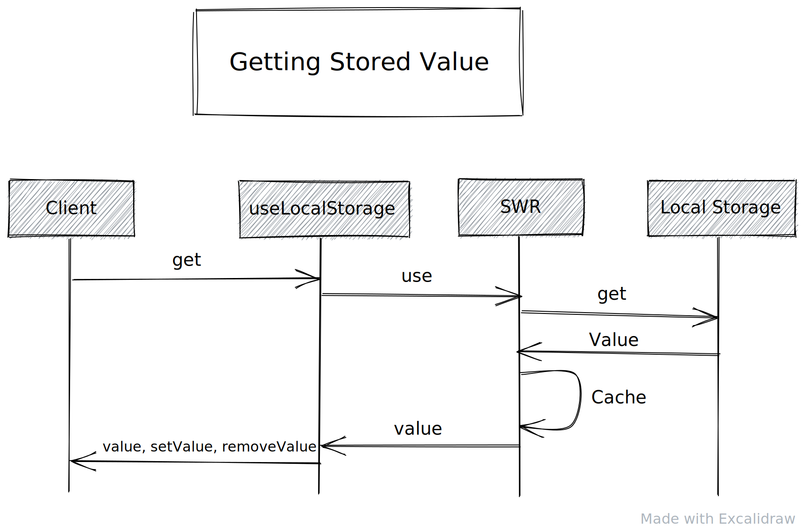

# SWR Internal State
This package is based on [swr](https://swr.vercel.app/) and it exports 2 react hooks to manage global in-app state.

The 2 hooks are `useGlobalState` and `useLocalStorage` (which is used for handling persistent state).

## Persistent Internal State
```ts
useLocalStorage<T>(key: string, defaultValue: T): [T, setValue: (T) => void, removeValue: () => void]
```
### Structure
Persistent state is managed through custom hooks that use the main `useLocalStorage` custom hook, this hook uses [SWR](https://swr.vercel.app) to manage its state and fetch the data from local storage and share the state with several components.

We provide a custom fetcher to SWR that fetches the data from the local storage rather than from a remote back-end server. The custom hook is defined within the same file for `useLocalStorage` hook, which can be found at `src/common/hooks/persistent/utils.ts`.

You should define a new custom hook for each state (object or value) that needs to be stored in the local storage. These hooks hard-code the key for the value that `useLocalStorage` accepts, this key is used to save the data to the local storage and to enable `swr` to share the value across several  components and keep them updated when the value changes.

The custom hook `useLocalStorage` returns an array of 3 items:
  1. `storedValue`: The value that is stored in the local storage (or default value if no value is stored).
  1. `setValue`: A function that accepts a new value to be saved in the local storage and to update the state of `swr`.
  1. `removeValue`: A function that removes the value from local storage and set `swr` state to the default value.

When a custom hook is called to use a state that is saved in the local storage, the following happens:
  1. The custom hook calls `useLocalStorage` with the corresponding key and return type.
  1. `useLocalStorage` calls `swr` with the custom fetcher to fetch the value from the local storage, then returns the fetched value or the default value if no data is stored.

The following diagram describes the said flow


When the `setValue` function is invoked, the following happens:
  1. `swr`'s state is updated with the flag `shouldRevalidate` set to `false` so no revalidation happens.
  1. If the call is done client-side then the local storage is updated with the new value.

The following diagram describes the said flow


When `removeValue` function is invoked, the following happens:
  1. `swr`'s state is set to the default value with the flag `shouldRevalidate` set to `false` so no revalidation happens.
  1. If the call is done client-side then the related key is removed from the local storage.

The following diagram describes the said flow


### Usage
Knowledge of `swr` is not required to be able to use the created custom hooks, you only call the hooks in the component that needs them. The value of the related resource is synced across all the components that use it, so when it's updated in one component using `setValue` or `removeValue` functions, the update is synced across all the components that use the custom hook.

## Global State
```ts
useGlobalState<T>(key: string, defaultValue: T): [T, setValue: (T) => void]
```

### Structure
This hook works exactly the same as `useLocalStorage` hook, except that it does now save the state in the local storage, it's only used to keep a global state across the app, and sync any update that happens to that state to all the components that use it.

### Usage
In an abstract way, all calls of this hook with the same `key` will return the same state. But you should create a custom hook for each state that you need and hard-code the `key` into that custom hook, then use that custom hook to manage your state.

This hook has return signature that is identical to `setState` from react. It returns an array that holds the state, and a function that sets that state.

## Rationale for Using SWR
We found that we can use `swr` to fetch and cache the data from the local storage, and it would be a lot simpler to use than redux or any other internal data store and would result in a simpler code base to maintain, so we did some small experimentation with SWR and things went on very well with it.